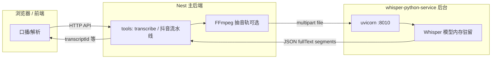

# Whisper Python 转写服务

本目录位于 **`backend/whisper-python-service`**（与 Nest 同仓，HTTP 集成，非 Nest 进程内嵌）。

与 Nest `WHISPER_HTTP_URL` 对齐：**POST `/transcribe`**（`multipart` 字段名 `file`），返回 `fullText`、`language`、`segments`。

## 从「CMD 里跑 whisper」到「后台常驻」

| 以前（命令行） | 现在（本项目） |
|----------------|----------------|
| 在 CMD 执行 `whisper audio.wav`，文案打印在终端 | 本目录启动 **长期进程**（`uvicorn`），Whisper **模型只加载一次**，留在内存里 |
| Web/后端难以稳定解析子进程 stdout、并发差 | 主后端通过 **HTTP** 上传文件，拿到 **JSON**（全文 + 分段 + 语言），与前端、任务流一致 |
| 每次新开进程都要冷启动 | 同一进程内多次 `POST /transcribe`，仅推理新文件，延迟更低 |

`server.py` 使用 Python 包 **`openai-whisper`**（`whisper.load_model` + `model.transcribe`），与官方 CLI 底层同源；**不要求**再在 CMD 里敲 `whisper` 可执行文件。

### 集成流程（谁调谁）



**运行时要同时存在的进程（开发机）：**

1. **Whisper**：`npm run whisper:dev`（本仓库根目录）→ 监听 `127.0.0.1:8010`。
2. **Nest**：`backend` 里配置好 `WHISPER_HTTP_URL=http://127.0.0.1:8010/transcribe` 并启动。
3. **前端**：照常调后端；转写不直连 8010，一律经 Nest。

**「后台运行」的含义：** 单独开一个终端（或 Docker 容器、`docker compose` 里的 `whisper` 服务）**保持 uvicorn 不退出**；不要用「每转写一次就起一次 CMD」的方式接入 Web。

## 依赖

- Python 3.10+（推荐 3.11）
- 系统已安装 **ffmpeg**（Whisper 解码音视频需要）
- `pip install -r requirements.txt`

## 本地启动（供本机 `backend` 联调）

在仓库**根目录**：

```bash
npm run whisper:dev
```

或在 `backend` 目录：

```bash
npm run whisper
```

等价于：`python -m uvicorn server:app --host 127.0.0.1 --port 8010`（工作目录为 **`backend/whisper-python-service`**）。

然后在 `backend/.env` 中设置：

```env
WHISPER_HTTP_URL=http://127.0.0.1:8010/transcribe
```

并重启 Nest。健康检查：**GET** `http://127.0.0.1:8010/health`。

## 用 Docker 只起 Whisper（不装本机 Python）

在项目根目录：

```bash
npm run whisper:docker
```

Compose 已将 **8010** 映射到宿主机，上述 `WHISPER_HTTP_URL` 同样适用。

## 一体化部署

见仓库根目录 **`docker-compose.yml`** 与 **`deploy/`**（`docker compose up` 时 `api` 容器内使用 `http://whisper:8010/transcribe`，无需改本机地址）。

## 环境变量

| 变量 | 说明 |
|------|------|
| `WHISPER_MODEL` | 模型名，默认 `medium`（越大越准越慢） |
| `WHISPER_PRELOAD` | Docker 入口脚本中：`1` 表示启动时预加载模型 |
